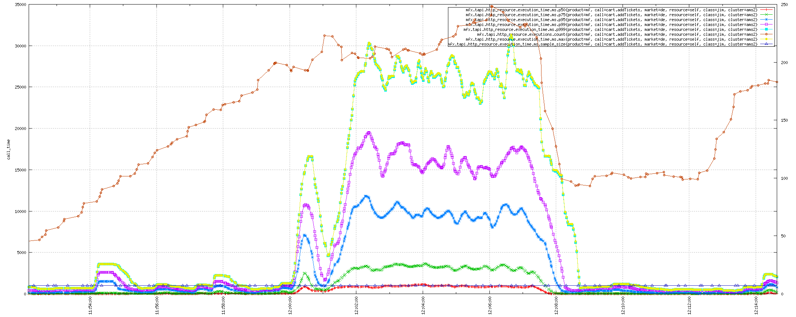
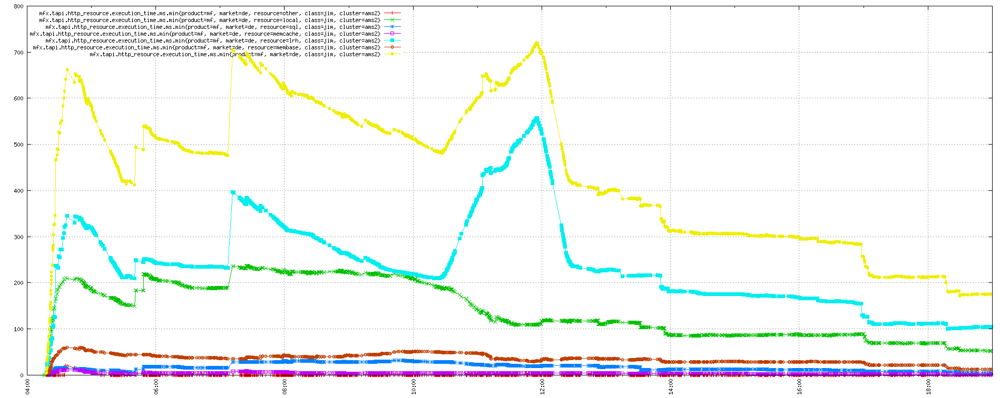

<h1>logmetrics-collector</h1>

logmetrics-collector is aimed at parsing log files containing performance data, computing statistics and outputting them to TSD or tcollector while using limited ressources. See also for a quick summary of the idea behind this kind of metric statistical aggregation:
- [http://pivotallabs.com/139-metrics-metrics-everywhere/]
- [http://metrics.codahale.com/getting-started/] \- Note that logmetrics-collector only implements a subset of this library, Meter and Histogram.
- [Forward Decay Priority Sampling|http://dimacs.rutgers.edu/~graham/pubs/papers/fwddecay.pdf]: Paper on the method used for histogram generation.

Big thanks to rcrowley for his go-metrics library!

Here's 3 examples of that data it generates:
Exponentially weighted moving call count average by 1, 5 and 15 minutes (like Unix load average seen in uptime) + call count:


Percentiles on executions times + call count:



Distribution of minimum time spent by resource for calls + total time spent (sum of all of resources):




<h2>Features list</h2>

- Generic: everything is in the configuration file..
- Not real time based, only the time seen in the log files is used for everything.
  - Handle log lag gracefully.
  - Can push old logs to TSD with accuracy. (If TSD can accept it, see limitations)
- Handles TSD slowness or absence gracefully through buffering and blocking.
  - If it can't push data to TSD it will wait until it can, progressively blocking its internal functions up to blocking the file tailer. Once TSD becomes available again it will then continue to parse the logs where it was and push was was currently waiting for it.
- Pushes clean data to TSD: no duplicate key and order is always respected.
  - If a key has been updated but hasn't changed in value it will still push it, mostly for precision on old log import. In realtime use tcollector will deal with that use case to limit the number of points sent.
- Scale CPU and network-wise.
  - Can use X threads for statistical computation and regexp matching. (See goroutines)
  - Can use X pusher threads to TSD to get better throughput to it.
- Low resource usage.
  - This is directly dependent on the configuration used and the number of keys tracked and activity in the logs.
  - Without actually sending data to TSD it can generate 250k key/s giving ~44Mb/s of data on a i7 laptop using 4 threads.
- Easy to deploy: a single statically compiled binary.
- Written in Go.

<h2>Configuration</h2>

Here's the configuration for fictional service.  Comments inline. It's in json-like yaml.
```
{
  # Log group, you can define multiple of these
  rest.api: {
    # Glob expression of the files to tail
    files: [ "/var/log/rest_*.perf.log" ],

    # Regular expression used to extract fields from the logs.
    # Spaces are stripped, comments are stripped, literal "\n" are necessary at the end of the line.
    re:
      '([A-z]{3}\s+\d+\s+\d+:\d+:\d+)\s+                           # Date 1 \n
       (\S+)\s+                                                    # server 2, class 3,\n
       rest_([a-z]+).api:.*                                        # rest type 4 \n
       \[c:(\S+)\].*                                               # call 5 \n
       \(([0-9]+)\)\s+                                             # call time 6 \n
       \[bnt:([0-9]+)/([0-9]+)\]\s+                                # bnt calls 7, bnt time 8 \n
       \[sql:([0-9]+)/([0-9]+)\]\s+                                # sql calls 9, sql time 10 \n
       \[membase:([0-9]+)/([0-9]+)\]\s+                            # membase calls 11, membase time 12 \n
       \[memcache:([0-9]+)/([0-9]+)\]\s+                           # memcache calls 13, memcache time 14 \n
       \[other:([0-9]+)/([0-9]+)\].*                               # other calls 15, other time 16 \n',

    # Validation of the previous regexp.
    expected_matches: 16,

    # How to parse the log date
    date: {
      # Match group number from the regexp wher to find the date
      position: 1,

      # Format of the date. See  http://godoc.org/time#pkg-constants for format
      format: "Jan  2 15:04:05" #rfc3164
    },

    # Prefix used in key name generation
    key_prefix: 'rest.api',

    # Tag lookup against regexp match group position.
    tags: {call: 5,
           host: 2,
           class: 3
    },

    # Metrics definition. Only meter and histogram are supported
    metrics: {
      meter: {
        # Key suffix to use for this type of metric.
        # The metric itself will then append multiple endings to this.
        key_suffix: "executions",

        # float or int. Defaults to int
        format: "int"

        # Multiply the value by this. Defaults to 1. Useful for time in float.
        multiply: 1

        # Regexp match groups where to use this metric type + tag(s) to append for it
        data: [
          [0,  "resource=local"], #When pos=0, simply inc counter by 1
          [7,  "resource=bnt"],
          [9,  "resource=sql"],
          [11,  "resource=membase"],
          [13, "resource=memcache"],
          [15, "resource=other"]
        ]
      },
      histogram: {
        key_suffix: "execution_time.ms",
        data: [
          # Operations add or sub can be applied to the value. Here we substract all the
          # resource accesses from the total time so we only have the time spent on the server.
          [6,  "resource=local" , {sub: [8,10,12,14,16]}],
          [8,  "resource=bnt"],
          [10,  "resource=sql"],
          [12, "resource=membase"],
          [14, "resource=memcache"],
          [16, "resource=other"]
        ]
      }
    },

    # Histogram sampler parameters. See Exponential Decay in http://dimacs.rutgers.edu/~graham/pubs/papers/fwddecay.pdf
    histogram_size: 1024,
    histogram_alpha_decay: 0.15,
    histogram_rescale_threshold_min: 10,

    #Maximum interval for EWMA calculation when no new data has been parsed for a key
    ewma_interval: 300,
    #Split workload on multiple go routines to scale across cpus
    goroutines: 1,

    #Push data to TSD every X seconds. Default to 15.
    interval: 15,

    # Log a warning when the regexp fails. Useful for performance-only logs. Defaults to false.
    warn_on_regex_fail: true,

    # Log a warning when a metric operation fails (result lower than 0). Default to false.
    warn_on_operation_fail: false,

    # Parse log from start. Allows to push old logs, otherwise it will start at its current end of the file. Defaults to false.
    parse_from_start: false
  },

  # Section for general settings
  settings: {
    # Interval at which to look for new log file
    poll_interval: 5,

    log_facility: "local3",

    # Information on where to send TSD keys
    push_port: 4242,
    push_host: "tsd.mynetwork",

    # tcp or udp. tsd is tcp, tcollector is udp.
    push_proto: "tcp",

    # tsd or tcollector
    push_type: "tsd",

    # Number of parallel senders.
    push_number: 1,

    #Seconds to wait before retrying to send data when unable to contact tsd/tcollector
    push_wait: 5
  }
```

With this configuration and the level of information we have in the performance logs in this fictive applications we can extract the following information:
- Meter information: Simple counter going up by the value parsed on each line.
  - Call count
  - Resource call count: bnt, sql, membase, memcache, other (tct, etc)
- Histogram information: Distribution of the value parsed.
  - Call time
  - Resource call time: bnt, sql, membase, memcache, other

For each of these we compute:
- Meter: Adds up a counter, push it as a key and computes:
  - Exponentially weighted moving average 1, 5 and 15 minutes. (Like Unix load average)
- Histogram: Sample timers parsed and computes:
  - Min, max and average.
  - Percentiles 50, 75, 95, 99 and 999.
  - Standard deviation.

All this information is specific to a single host. A single call generates 13 stats * 6 resources = 78 keys every "interval".

<h2>Keys generated</h2>

<h3>Meter</h3>

- <key_prefix>.<key_suffix>.count: Sum of the values.
- <key_prefix>.<key_suffix>.rate.times1k._1min: Moving average over 1 minute multiplied by 1000 to give better precision.
- <key_prefix>.<key_suffix>.rate.times1k._5min: Moving average over 5 minutes multiplied by 1000 to give better precision.
- <key_prefix>.<key_suffix>.rate.times1k._15min: Moving average over 15 minutes multiplied by 1000 to give better precision.

Example:
```
rest.api.executions.count 1391745780 4 call=getUser host=api1.mynetwork class=api
rest.api.executions.rate.times1k._1min 1391745780 0 call=getUser host=api1.mynetwork class=api
rest.api.executions.rate.times1k._5min 1391745780 0 call=getUser host=api1.mynetwork class=api
rest.api.executions.rate.times1k._15min 1391745780 0 call=getUser host=api1.mynetwork class=api
```

h3. Histogram

- <key_prefix>.<key_suffix>.min: Minimum in the sample.
- <key_prefix>.<key_suffix>.max: Maximum in the sample.
- <key_prefix>.<key_suffix>.mean: Average of the sample.
- <key_prefix>.<key_suffix>.std_dev: Standard deviation.
- <key_prefix>.<key_suffix>.p50: Percentile 50.
- <key_prefix>.<key_suffix>.p75: Percentile 75.
- <key_prefix>.<key_suffix>.p95: Percentile 95.
- <key_prefix>.<key_suffix>.p99: Percentile 99.
- <key_prefix>.<key_suffix>.p999: Percentile 99.9.
- <key_prefix>.<key_suffix>.sample_size: Current sample size. For sampler tuning, likely to disappear. Badly named as well, gets the time unit right before it.

Example:
```
rest.api.execution_time.ms.min 1391745767 11 call=getUser host=api1.mynetwork class=api
rest.api.execution_time.ms.max 1391745767 16 call=getUser host=api1.mynetwork class=api
rest.api.execution_time.ms.mean 1391745767 13 call=getUser host=api1.mynetwork class=api
rest.api.execution_time.ms.std-dev 1391745767 2 call=getUser host=api1.mynetwork class=api
rest.api.execution_time.ms.p50 1391745767 12 call=getUser host=api1.mynetwork class=api
rest.api.execution_time.ms.p75 1391745767 16 call=getUser host=api1.mynetwork class=api
rest.api.execution_time.ms.p95 1391745767 16 call=getUser host=api1.mynetwork class=api
rest.api.execution_time.ms.p99 1391745767 16 call=getUser host=api1.mynetwork class=api
rest.api.execution_time.ms.p999 1391745767 16 call=getUser host=api1.mynetwork class=api
rest.api.execution_time.ms.sample_size 1391745767 3 call=getUser host=api1.mynetwork class=api
```

h2. Internals

One of the reason Go was used was the concept of goroutines and channels. A goroutine is a lightweight threads managed by go itself. Go will schedule/unschedule these onto real system thread for execution. They are very cheap, using only 8k of memory each. A Go program as the choice of the number of real thread it will use, thus making program with workload distributed one multiple goroutines easily scalable on any number of processors.

Channels are a way to communicate between goroutines that's safer and easier to read than mutexes. Think of it as a pipe between threads that can be buffered, where operations are atomic and will block when writing when it's full or reading when it's empty. In the case of logmetrics-collector this enable stream processing of the log lines. Thus we have:

- 1 goroutine that check for log files which weren't previous tailed, start a file tailing goroutine on it if one is detected.
- 1 goroutine by file to read each line and apply the regexp to extract data. These will send the regexp matches to one of its datapools via a channel.
  - If the datapool is blocked, it will wait until it can send the data before it continues parsing its log.
- X goroutines by datapool. These are associated to a specific log group and will receive information from of log tailers, collect it, generate stats and keys from it and send the data via another channel to the TSD sender when enough time has passed according to the logs.
- X goroutines for TSD senders, enables multiple streams out if a single isn't sending fast enough.

*FIXME* make a diagram of this

<h2>Todo</h2>

List of tasks pending related to logmetrics-collector.

- Patch tcollector to allow default tags to be overridden. (class, product and cluster specifically) -Done
- Add arithmetic for metric values. -Done
  - The time histogram of "resource=self" should be the time spent on the server minus the time of every other resources. Currently it's the total call time make the graph omitting the resource tag incorrect. -Done
- Recover gracefully from panics (if any)
- Persist file tailer position and datapool to disk to enable downtime without side effect.
- Push internal metrics to TSD: Mem usage, GC info, key/data sent, data pool size, line parsed, etc.
- Commit code somewhere. Github or stick to TM-only?
- Clean up go-metrics remains.
- Nice to have: Come up with a cleaner way code-wise to parse config, make interface{} for metrics.


Many thanks to Kieren Hynd for the idea and input!
